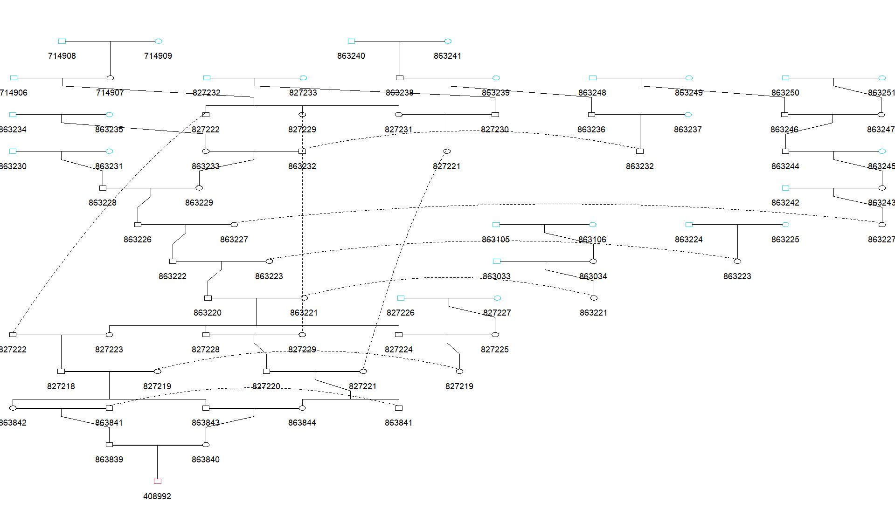

### Using gen.simuHaplo_traceback

the traceback function allows the user to specify a proband and a
founder, and given the output of `gen.simuHaplo` the traceback
function will go through all the simulations, identify the simulations
in which the proband inherits any segment from the specified founder,
and then identify the path of inheritance.

For this example we will use a small sub-tree of the 58942 individual
Montreal genealogy used in the other example.  
Load in example genealogy:

``` r
library(GENLIB)
```

    ## Loading required package: Rcpp

``` r
library(readr)
genealogy_file <- read_csv("../example_genealogy.csv", col_types = 'iiii')
gen_obj <- gen.genealogy(genealogy_file)
gen_obj
```

    ##  GENLIB: Genealogical Data Software version  1 
    ## 
    ##   Number of individuals :  58942 
    ##   Number of parent-child relations :  99694 
    ##  Number of men  :  29342 
    ##   Number of women :  29600 
    ##   Number of subjects :  227 
    ## 
    ## 
    ##  Genealogical depth : 17
    ## 
    ##  Created on : Wed Dec 07 11:06:31 2022

Create sub-tree for the proband and ancestor of interest:

``` r
#create sub-genealogy to use for example
gen_obj2 <- gen.branching(gen_obj, pro=c(222), ancestors = c(1034))
gen.graph(gen_obj2, cex=0.70) #plot the genealogy
```

<!-- -->

We can see we have a founder with ID ‘1034’, and a descendant ‘222’
connected by 6 possible paths of inheritance.

For this example we will simulate a hypothetical chromosome 1, with a
length of 290,000,000 BP and genetic length of 198cM for males, and
328cM for females. We will use a Poisson process as the model of
meiosis, and we will produce the all_nodes output which is required for
the traceback.

``` r
gen.simuHaplo(gen_obj2, model = 1, simulNo = 200, model_params = c(1.98, 3.28), 
              cM_len = c(198, 328), BP_len = 290000000, all_nodes = 1)
```

Now that we have the simulation results we can use the traceback
function to investigate the relationship between this proband and
ancestor. For this we use the **gen.simuHaplo_traceback** function. The
function requires the following parameters:    
<ins>**gen:**</ins> The genealogy object that was used for the simulation.  
<ins>**proID:**</ins> The ID of the proband.  
<ins>**ancestorID:**</ins> ID of the founder. Any segment
from this founder appearing in the proband haplotype will be traced
back.  
<ins>**all_nodes_path:**</ins> The path to the ‘All_nodes_haplotypes.txt’
file created from the simulation.  
<ins>**proband_haplotypes_path:**</ins> The path
to the ‘Proband_Haplotypes.txt’ file created from the simulation.

``` r
traceback <- gen.simuHaplo_traceback(gen_obj2, proID =222, ancestorID = 1034, 
                                     all_nodes_path = 'All_nodes_haplotypes.txt',
                                     proband_haplotypes_path = 'Proband_Haplotypes.txt')
## input file paths:
## All_nodes_haplotypes.txt
## Proband_Haplotypes.txt
## 
## path: 1 939 2068 3362 9780 10037 26294 43595 6521 6036 1105 335 1034 
## path: 2 938 2306 3406 10032 21272 16541 8070 2421 1153 335 1034 
## path: 3 939 2068 3362 9780 10037 26284 19451 6980 3163 2421 1153 335 1034 
## path: 4 938 2306 3406 10032 21276 3291 2869 2941 1100 335 1034 
## path: 5 939 2068 3362 9780 9596 23169 18027 7517 2869 2941 1100 335 1034 
## path: 6 939 2068 3362 9780 9596 23161 36169 42736 33780 17208 1105 335 1034
```

The traceback function will print all the paths that it encounters in
the simulation results, in the order that it encounters them. Note that
if a path does not end with the ancestor ID that means the path
bifurcates at the last internal ancestor that was printed. If an
internal ancestor is homozygous for the founder segment it is possible
for it to transmit a longer segment that has been stitched together
through a recombination. In this case the inheritance path for that segment
will terminate at this internal ancestor.

The function returns a dataframe that specifies the path, and the length
of the segment, for each occurance of the specified proband inheriting a
segment from the specified founder.

``` r
head(traceback)
```

    ##   simulNo seg_length path_n
    ## 1       5   33019991      1
    ## 2      15    2186422      2
    ## 3      38   14964820      2
    ## 4      38     592949      2
    ## 5      64    3017193      3
    ## 6      70    6782128      4
