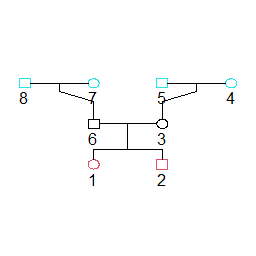

## Using gen.simuHaplo_convert

For this example we will use simulated haplotypes for a simple pedigree of 2 siblings (probands) and their grandparents (founders).  
  
To use `reconstruct.pl` we need to provide the `Proband_haplotypes.txt` output from `gen.simuHaplo()`. The output file in this example is from a hypothetical 100,000,000 BP chromosomal segment, simulated with the following parameters:
```
require(GENLIB)
sample_data <- data.frame(ind=c(1,2,3,6,7,8,4,5), 
                          mother=c(3,3,4,7,0,0,0,0),
                          father=c(6,6,5,8,0,0,0,0),
                          sex =c(2,1,2,1,2,1,2,1))

sample_gen <- gen.genealogy(sample_data)
gen.simuHaplo(sample_gen, model = 1, simulNo = 10, model_params=c(1,1), cM_len=c(100,100), BP_len = 100000000)
```  
Then to use `gen.simuHaplo_convert` we need to provide the sequence data for the founders. This data should be specified in two files "founders.hap", and "founders.map" all present in the same directory. The "founders.hap" file should contain sequences for each founder chromosome. This file should contain a line for each founder chromosome, each line should be the ID followed by a string (encoding the genotype), in the same formatting as the example file. The sequences should all be strings of the same length, and can be composed of any characters, where each character represents the genotype at a particular BP location. The "founders.map" file should contain loci for each of these genotypes. This file should only contain a sequence of integers, each on a new line, where each line is the BP position of the corresponding character in the strings contained in the other file.   

The function will automatically search for files called "Proband_Haplotypes.txt", "founders.hap", and "founders.map" To use the the user only needs to pass in the path to the directory where these files are located. This will default to the current working directory:    
 ```
gen.simuHaplo_convert()
```
After running the function the proband haplotypes will be converted to sequence data according to the provided founder sequence data, and the output will be saved as `Proband_Genotypes.txt` in the same directory.
